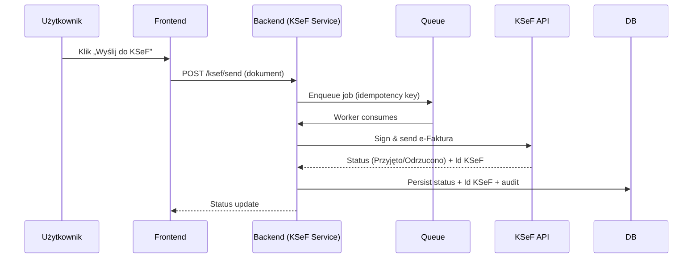
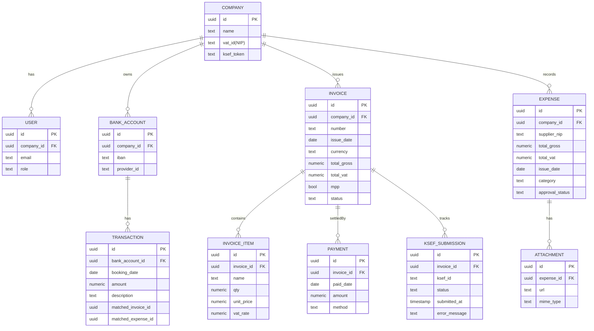

# Technical Documentation

## 1. System Architecture

### 1.1 Context Diagram
```mermaid
graph TD
    U[Użytkownik] --> FE[Frontend (Next.js)]
    FE --> BE[Backend (NestJS)]
    BE --> DB[(PostgreSQL)]
    BE --> REDIS[(Redis Cache)]
    BE --> S3[(S3 Storage)]
    BE --> MQ[[Queue (RabbitMQ/Kafka)]]
    BE --> OBS[(Logs/Metrics)]
    subgraph Integrations
      KSEF[KSeF API]:::ext
      AIS[AIS Bank Provider]:::ext
      OCR[OCR Service]:::ext
    end
    BE --> KSEF
    BE --> AIS
    BE --> OCR

    classDef ext fill:#fff,stroke:#333,stroke-dasharray: 3 3
```

### 1.2 KSeF Send Sequence


### 1.3 ER Diagram (Core)


## 2. API Specifications (MVP subset)

### 2.1 Authentication
- `POST /api/auth/login`
  - Request: `{ "email": "user@example.com", "password": "..." }`
  - Response: `{ "token": "jwt", "user": { "id": "...", "role": "ACCOUNTANT" } }`

### 2.2 Invoices
- `POST /api/invoices`
  - Creates VAT invoice („Wystaw fakturę”).
  - Request: `{ "number": "FV/12/2025", "issueDate": "2025-12-01", "currency": "PLN", "buyerNip": "1234563218", "items": [{ "name": "Usługa", "qty": 1, "unitPrice": 100, "vatRate": 23 }], "mpp": true }`
  - Response: `{ "id": "...", "status": "Utworzono" }`
- `POST /api/invoices/:id/ksef/send`
  - Sends to KSeF.
  - Response: `{ "status": "Przyjęto", "ksefId": "KSeF-XYZ..." }` or `{ "status": "Odrzucono", "message": "Nieprawidłowa struktura FA" }`
- `GET /api/invoices/:id`
  - Returns invoice details + KSeF status.

### 2.3 Expenses (Koszty)
- `POST /api/expenses`
  - Upload cost doc via multipart; OCR extraction.
  - Response: `{ "id": "...", "ocr": { "supplierNip": "...", "totalGross": 123.45, "vat": 23.45 } }`
- `PUT /api/expenses/:id`
  - Update/correct fields; set `approvalStatus` → „Zatwierdzony”.

### 2.4 Bank & Reconciliation
- `POST /api/bank/connect`
  - Initiate AIS OAuth („Połącz konto bankowe”).
- `GET /api/bank/transactions`
  - List synced transactions; matched/unmatched.
- `POST /api/reconcile`
  - Manual match transaction → invoice/expense.

### 2.5 VAT/JPK
- `GET /api/vat/registers?month=2025-11`
  - Returns Ewidencja VAT Sprzedaży/Zakupu.
- `POST /api/jpk/v7/export?month=2025-11`
  - Generates JPK_V7 XML; returns download URL.

### 2.6 ZUS
- `POST /api/zus/dra?month=2025-11`
  - Generates DRA; supports e‑submission.
- `POST /api/payments/vat`
  - Creates bank transfer with correct tytuł płatności.

### 2.7 Webhooks & API Keys
- `POST /api/developer/keys`
  - Create API key; returns `{ key: "..." }`.
- Webhook event: `payment.matched`
  - Payload: `{ "invoiceId": "...", "transactionId": "...", "status": "Opłacone" }` with `X-Signature: HMAC`.

## 3. Database Schema Design (Tables & Keys)
- Multi‑tenant: all business tables include `company_id` (FK).
- Keys & indexes:
  - `invoices(number, company_id)` unique; index on `status` and `issue_date`.
  - `transactions(bank_account_id, booking_date)` index; partial index for `matched_invoice_id IS NULL`.
  - `ksef_submissions(invoice_id)` unique per idempotency key.
- Migrations: semantic versioned; forward‑only; rollback via corrective migrations.

## 4. Infrastructure Requirements
- Environments: `dev`, `staging`, `prod`.

### Provider Options
- Vercel + Supabase (Recommended MVP)
  - Compute: Vercel serverless/edge (Next.js API routes) for web/API.
  - Data: Supabase Postgres; Storage buckets; Auth.
  - Jobs: Vercel Cron + background processing; heavy jobs offloaded to a worker.
  - Secrets: Vercel env vars + Supabase secrets; KSeF cert as base64 env.
  - Observability: Vercel Analytics + application metrics; error alerts on KSeF/AIS.
- Cloudflare (Edge‑first)
  - Compute: Cloudflare Workers; Durable Objects; Queues.
  - Data: R2 (storage), D1 or Hyperdrive for Postgres connectivity.
  - Secrets: Wrangler secrets; KSeF certificate encrypted in R2.
  - Observability: Workers metrics; logs to central store.
- AWS ECS/K8s (Enterprise fallback)
  - Compute: containers (ECS/K8s) for long‑running services.
  - Data: RDS PostgreSQL, ElastiCache Redis, S3, OpenSearch.
  - Networking: VPC, private subnets, ALB/WAF; Secrets Manager.

### Security & Compliance
- TLS everywhere, encryption at rest; row‑level isolation for multi‑tenant.
- Audit trails for submissions/postings/permission changes.
- Backups & DR per provider (Supabase PITR, R2/S3 lifecycle).

### Jobs (Option A)
- Vercel Cron invokes `/api/jobs/ksef-batch` for queued submissions.
- Batch sender reads pending documents, decodes `KSEF_CERT_B64`, signs and sends to KSeF.
- Idempotency keys ensure no duplicate submissions; status updates persisted.

## 5. Technical Policies
- Idempotency for external sends (KSeF, webhooks) via deterministic keys.
- Retry/backoff for AIS/OCR/KSeF; circuit breakers.
- PII minimization in logs; full audit trails for submissions and postings.
- Feature flags for schema/version changes (MF KSeF/JPK updates).

---
This document is authoritative for implementation details. Any deviations must be approved in architecture review.
