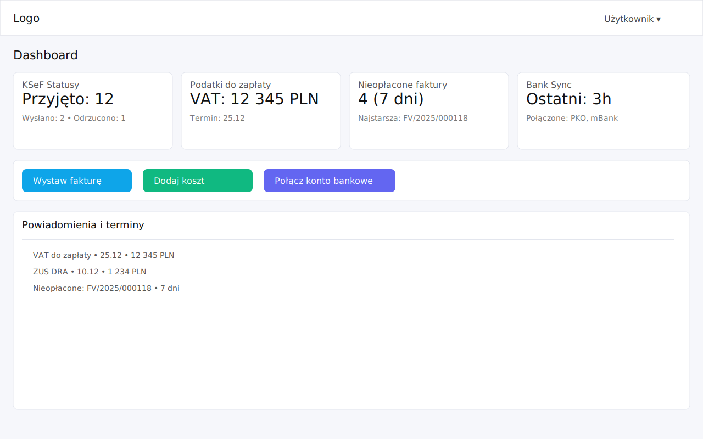
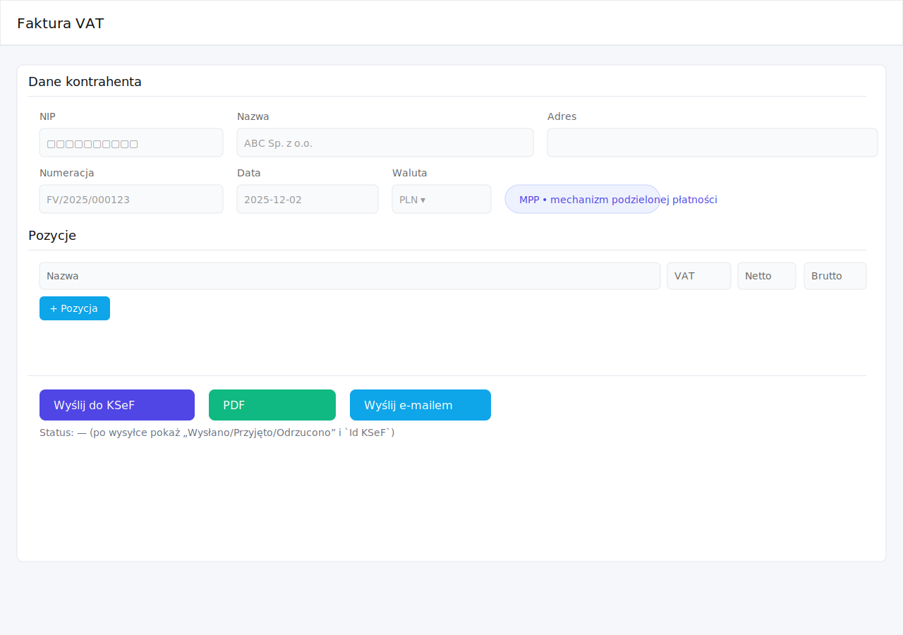
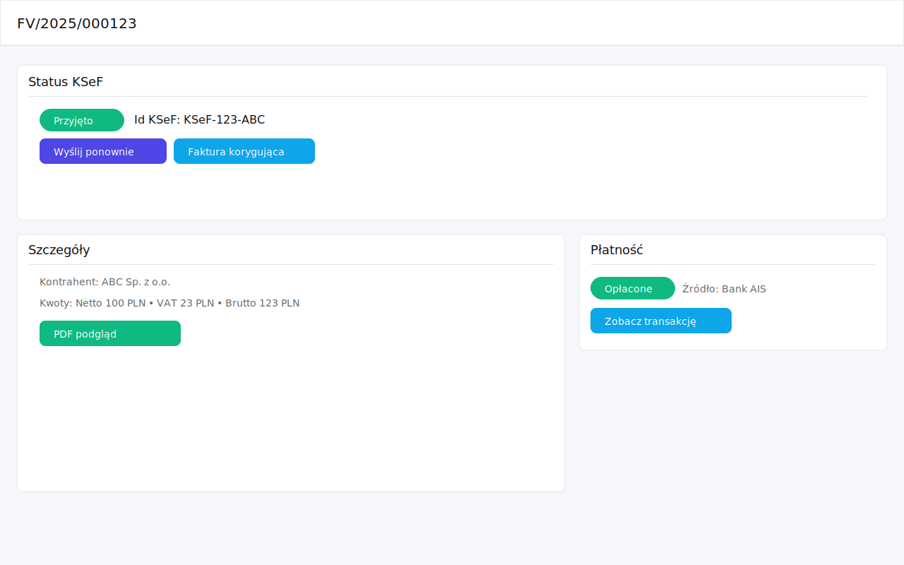
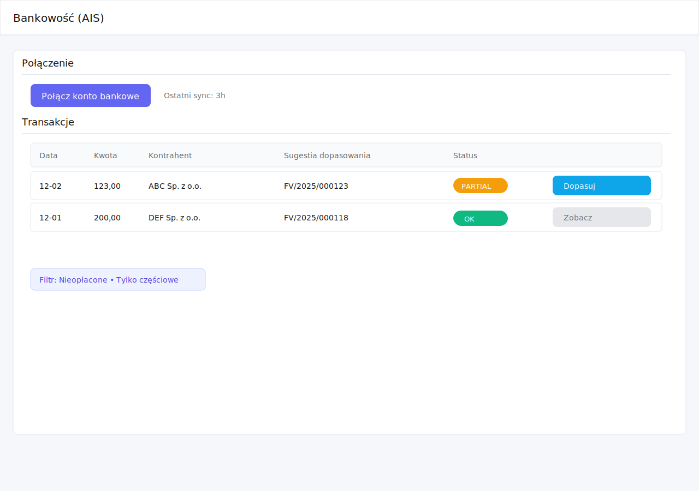
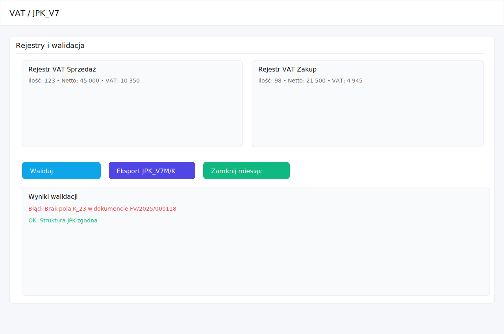
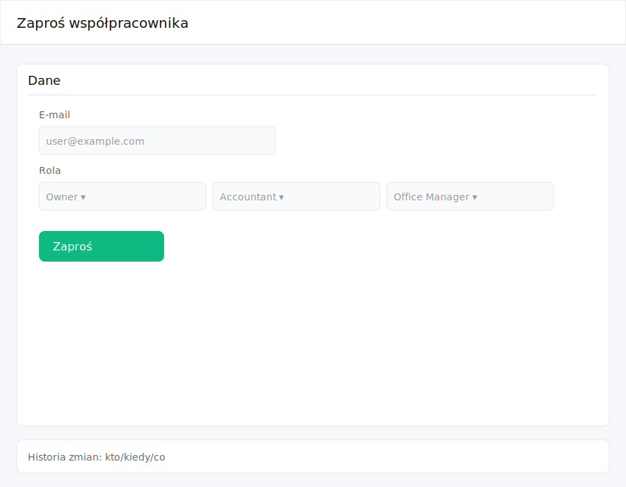
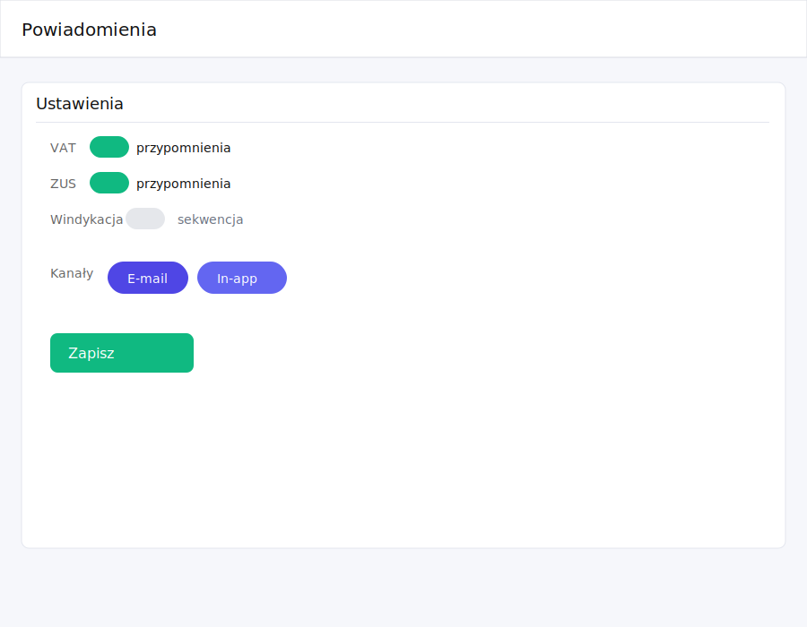

# Wireframes

Note: Labels use PRD terms; keep layouts simple for dev handoff.

## Design System

**Shandon CSS 3-Color Theme**:
- Primary (P1): `#0f172a` - Dark slate/navy for navigation, primary actions
- Secondary (P2): `#3b82f6` - Blue for secondary actions, links, accents
- Tertiary (P3): `#10b981` - Green/teal for success states, highlights

**Key Features**:
- Touch-optimized (44px+ tap targets)
- Premium UI with gradients and shadows
- Full accessibility (WCAG 2.1 AA)
- Responsive mobile-first design
- Smooth animations and transitions

## Medium‑Fidelity SVGs
- Dashboard: 
- Invoicing form: 
- Invoice detail: 
- Costs/OCR: 
- Bank reconciliation: 
- VAT/JPK: 
- Roles/Invite: 
- Notifications: 

## Clickable Prototype

**Live Server**: `http://localhost:8000` (when running)

**Pages**:
- Dashboard: `docs/UX/prototype/index.html`
- Faktura: `docs/UX/prototype/invoicing.html`
- Szczegóły FV: `docs/UX/prototype/invoice.html`
- Koszt/OCR: `docs/UX/prototype/costs.html`
- Bank/AIS: `docs/UX/prototype/bank.html`
- VAT/JPK: `docs/UX/prototype/vat.html`
- Współpracownik: `docs/UX/prototype/invite.html`
- Powiadomienia: `docs/UX/prototype/notifications.html`
- Raporty: `docs/UX/prototype/reports.html`
- Ustawienia: `docs/UX/prototype/settings.html`

**Shared Stylesheet**: `docs/UX/prototype/styles.css`

## Accessibility Features

All prototype pages include:
- Skip link for keyboard navigation
- Semantic HTML (`<header>`, `<nav>`, `<main>`, `<form>`)
- ARIA attributes (`aria-label`, `aria-current`, `aria-required`, `aria-invalid`, `aria-describedby`)
- Focus indicators (3px outline with offset)
- Screen reader support (`sr-only` class, `role="status"`, `aria-live`)
- Proper form labels and error associations

## Auto‑Synced Text Descriptions
- Open `docs/UX/Wireframes.html` to view auto‑generated textual descriptions next to each SVG.
- Descriptions are generated from SVG text labels in reading order, so any tweak to a wireframe is immediately reflected.

## Dashboard
```
[Skip Link: Przejdź do treści głównej]
----------------------------------------------------------------------------------+
||  [Dashboard] [Faktura] [Szczegóły FV] [Koszt/OCR] [Bank/AIS] [VAT/JPK] ...    |
||  (Gradient nav: #0f172a → #1e293b, sticky, backdrop-filter)                    |
----------------------------------------------------------------------------------+
||  Action Bar (white card, shadow-md, rounded-xl):                                 |
||  [Wystaw fakturę] (btn-primary, blue gradient)                                   |
||  [Dodaj koszt] (btn-secondary, green gradient)                                    |
||  [Połącz konto bankowe] (btn-primary, blue gradient)                             |
||  [☐ Mały ekran (390px)] (screen-toggle, right-aligned)                          |
----------------------------------------------------------------------------------+
||  [KSeF Statusy]   [Podatki do zapłaty]   [Nieopłacone faktury]   [Bank Sync]      |
||  Przyjęto: 12    VAT: 12 345 PLN        4 (7 dni)              Ostatni: 3h       |
||  (Widget cards with shadow-lg, rounded-xl)                                       |
----------------------------------------------------------------------------------+
||  Oś czasu powiadomień (VAT/ZUS/debtors)                                          |
||  (Wireframe: dashboard.svg)                                                      |
----------------------------------------------------------------------------------+
```

## Invoicing — "Wystaw fakturę"
```
[Skip Link] [Header with nav: aria-current="page" on Faktura]
----------------------------------------------------------------------------------+
||  Form Grid (form-grid-compact, white card, shadow-md, rounded-xl):              |
||  ┌─────────────────────────────────────────────────────────────────────────┐   |
||  │ NIP (label, uppercase)                                                  │   |
||  │ [NIP input: 44px height, 2px border, focus ring]                       │   |
||  │ <span id="nip-error" sr-only role="alert"></span>                      │   |
||  └─────────────────────────────────────────────────────────────────────────┘   |
||  ┌─────────────────────────────────────────────────────────────────────────┐   |
||  │ Numeracja (label)                                                        │   |
||  │ [FV/2025/000123] (pre-filled)                                            │   |
||  └─────────────────────────────────────────────────────────────────────────┘   |
||  ┌─────────────────────────────────────────────────────────────────────────┐   |
||  │ MPP (label, centered)                                                    │   |
||  │ [☐] (checkbox, 20px, accent-color: blue)                               │   |
||  └─────────────────────────────────────────────────────────────────────────┘   |
||  ┌─────────────────────────────────────────────────────────────────────────┐   |
||  │ Cena netto (label)                                                       │   |
||  │ [100.00] (number input)                                                  │   |
||  └─────────────────────────────────────────────────────────────────────────┘   |
||  ┌─────────────────────────────────────────────────────────────────────────┐   |
||  │ VAT (label)                                                               │   |
||  │ [23% ▾] (select: 23/8/5/0/zw)                                            │   |
||  └─────────────────────────────────────────────────────────────────────────┘   |
||  ┌─────────────────────────────────────────────────────────────────────────┐   |
||  │ [Wyślij do KSeF] (btn-primary, full-width, right-aligned)                │   |
||  └─────────────────────────────────────────────────────────────────────────┘   |
||                                                                                  |
||  Status Message (status.success/error, colored left border, aria-live):        |
||  "Przyjęto • FV/2025/000123 • Brutto 123.00 • Id KSeF-ABC123"                  |
||                                                                                  |
||  [☐ Mały ekran (390px)] (screen-toggle)                                        |
||                                                                                  |
||  Wireframe: invoicing_form.svg (rounded-xl, shadow-xl)                          |
|-----------------------------------------------------------------------------------+
```

## Invoice Detail
```
[Skip Link] [Header with nav: aria-current="page" on Szczegóły FV]
----------------------------------------------------------------------------------+
||  [☐ Mały ekran (390px)] (screen-toggle-container-alt)                           |
||                                                                                  |
||  Wireframe: invoice_detail.svg (rounded-xl, shadow-xl)                         |
||  KSeF: [Przyjęto]  Id: KSeF-123-ABC   [Wyślij ponownie] [Faktura korygująca]     |
||  Klient, kwoty, PDF podgląd                                                     |
||  Płatność: [Opłacone]  (źródło: Bank AIS)  [Zobacz transakcję]                   |
|-----------------------------------------------------------------------------------+
```

## Costs Upload / OCR Review — "Dodaj koszt"
```
[Skip Link] [Header with nav: aria-current="page" on Koszt/OCR]
----------------------------------------------------------------------------------+
||  Form Grid (form-grid-compact, white card, shadow-md, rounded-xl):              |
||  ┌─────────────────────────────────────────────────────────────────────────┐   |
||  │ NIP (label, uppercase)                                                  │   |
||  │ [NIP input: 44px, 2px border, error class if invalid]                  │   |
||  │ <span id="nip-error" sr-only role="alert"></span>                      │   |
||  └─────────────────────────────────────────────────────────────────────────┘   |
||  ┌─────────────────────────────────────────────────────────────────────────┐   |
||  │ Kwota (label)                                                             │   |
||  │ [123.45] (number input, pre-filled from OCR)                             │   |
||  └─────────────────────────────────────────────────────────────────────────┘   |
||  ┌─────────────────────────────────────────────────────────────────────────┐   |
||  │ VAT (label)                                                               │   |
||  │ [23% ▾] (select: 23/8/5/0/zw, pre-filled from OCR)                       │   |
||  └─────────────────────────────────────────────────────────────────────────┘   |
||  ┌─────────────────────────────────────────────────────────────────────────┐   |
||  │ Kategoria (label)                                                         │   |
||  │ [Koszty biurowe ▾] (18+ options: Paliwo, Marketing, Podróże, etc.)      │   |
||  └─────────────────────────────────────────────────────────────────────────┘   |
||  ┌─────────────────────────────────────────────────────────────────────────┐   |
||  │ [Wyślij do akceptacji] (btn-secondary, full-width, green gradient)      │   |
||  └─────────────────────────────────────────────────────────────────────────┘   |
||                                                                                  |
||  Status Message (status.success/error):                                         |
||  "Wysłano do akceptacji • [Kategoria]"                                          |
||                                                                                  |
||  [☐ Mały ekran (390px)] (screen-toggle)                                        |
||                                                                                  |
||  Wireframe: costs_ocr.svg (rounded-xl, shadow-xl)                                |
|-----------------------------------------------------------------------------------+
```

## Bank Connect & Reconciliation — "Połącz konto bankowe"
```
[Skip Link] [Header with nav: aria-current="page" on Bank/AIS]
----------------------------------------------------------------------------------+
||  Action Bar (white card, shadow-md, rounded-xl):                               |
||  [☐ Nieopłacone] (checkbox, aria-label)                                        |
||  [☐ Tylko częściowe] (checkbox, aria-label)                                     |
||  [Zastosuj filtry] (btn-primary, blue gradient)                                 |
||  [☐ Mały ekran (390px)] (screen-toggle, right-aligned)                          |
||                                                                                  |
||  Status Message (status.success):                                              |
||  "Filtry: Nieopłacone Częściowe"                                                 |
||                                                                                  |
||  Wireframe: bank_reconciliation.svg (rounded-xl, shadow-xl)                      |
||  | Data | Kwota | Kontrahent | Sugestia dopasowania | Status | [Dopasuj]         |
||  | 12-02| 123,00| ABC Sp. z o.o. | FV/2025/000123       | PARTIAL | [►]         |
|-----------------------------------------------------------------------------------+
```

## VAT/JPK
```
[Skip Link] [Header with nav: aria-current="page" on VAT/JPK]
----------------------------------------------------------------------------------+
||  Action Bar (white card, shadow-md, rounded-xl):                               |
||  [Waliduj] (btn-primary, blue gradient)                                         |
||  [Eksport JPK] (btn-primary, blue gradient)                                      |
||  [Zamknij miesiąc] (btn-secondary, green gradient)                               |
||  [☐ Mały ekran (390px)] (screen-toggle, right-aligned)                          |
||                                                                                  |
||  Status Message (status.success/error, aria-live="polite"):                     |
||  "Błąd: Brak pola K_23 w FV/2025/000118" (error)                                |
||  "Eksport JPK_V7M/K gotowy" (success)                                           |
||  "Miesiąc zamknięty" (success)                                                   |
||                                                                                  |
||  Wireframe: vat_jpk.svg (rounded-xl, shadow-xl)                                  |
||  Rejestry:  Sprzedaż [sumy]   Zakup [sumy]                                       |
|-----------------------------------------------------------------------------------+
```

## Roles / Invite — "Współpracownik"
```
[Skip Link] [Header with nav: aria-current="page" on Współpracownik]
----------------------------------------------------------------------------------+
||  Form Grid (form-grid-invite: 2fr 1fr auto, white card, shadow-md):            |
||  ┌─────────────────────────────────────────────────────────────────────────┐   |
||  │ E-mail (label, uppercase)                                              │   |
||  │ [user@example.com] (email input, 44px, aria-required)                │   |
||  │ <span id="email-error" sr-only role="alert"></span>                    │   |
||  └─────────────────────────────────────────────────────────────────────────┘   |
||  ┌─────────────────────────────────────────────────────────────────────────┐   |
||  │ Rola (label)                                                             │   |
||  │ [Owner ▾] (select: Owner/Accountant/Office Manager)                     │   |
||  └─────────────────────────────────────────────────────────────────────────┘   |
||  ┌─────────────────────────────────────────────────────────────────────────┐   |
||  │ [Zaproś] (btn-secondary, green gradient, right-aligned)                 │   |
||  └─────────────────────────────────────────────────────────────────────────┘   |
||                                                                                  |
||  Status Message (status.success/error):                                         |
||  "Zaproszono user@example.com jako Owner" (success)                             |
||  "Błąd: nieprawidłowy e‑mail" (error)                                           |
||                                                                                  |
||  [☐ Mały ekran (390px)] (screen-toggle)                                        |
||                                                                                  |
||  Wireframe: roles_invite.svg (rounded-xl, shadow-xl)                            |
|-----------------------------------------------------------------------------------+
```

## Notifications
```
[Skip Link] [Header with nav: aria-current="page" on Powiadomienia]
----------------------------------------------------------------------------------+
||  Form (action-bar style, white card, shadow-md, rounded-xl):                 |
||  <fieldset class="fieldset-inline">                                            |
||    <legend class="sr-only">Typy powiadomień</legend>                           |
||    [☑ VAT przypomnienia] (checkbox, aria-label)                                |
||    [☑ ZUS przypomnienia] (checkbox, aria-label)                                |
||    [☐ Windykacja sekwencja] (checkbox, aria-label)                             |
||    [☑ E‑mail] (checkbox, aria-label)                                           |
||    [☑ In‑app] (checkbox, aria-label)                                           |
||  </fieldset>                                                                    |
||  [Zapisz] (btn-secondary, green gradient)                                       |
||  [☐ Mały ekran (390px)] (screen-toggle, right-aligned)                          |
||                                                                                  |
||  Status Message (status.success):                                              |
||  "Zapisano • {"vat":true,"zus":true,...}"                                       |
||                                                                                  |
||  Wireframe: notifications.svg (rounded-xl, shadow-xl)                            |
|-----------------------------------------------------------------------------------+
```
